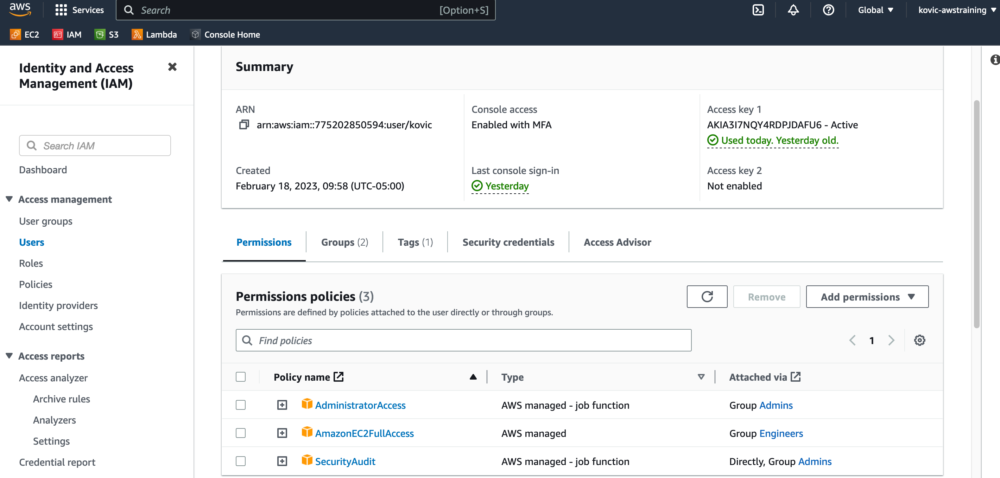
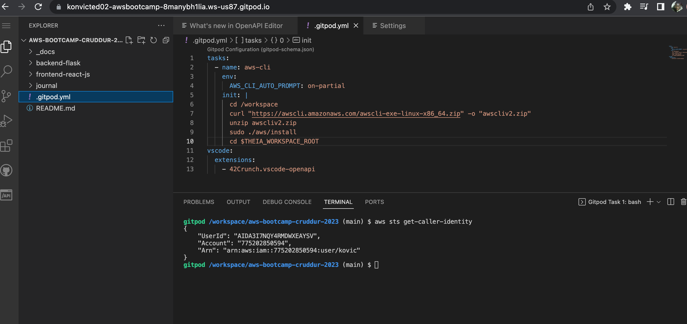
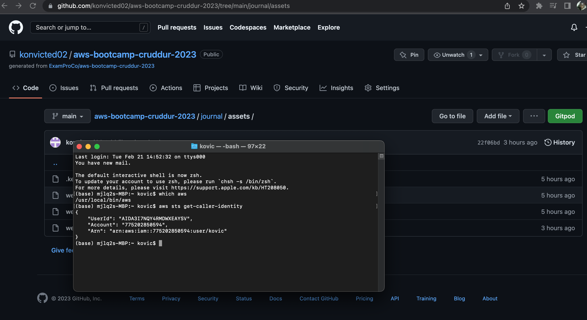

# Week 0 — Billing and Architecture

## Required Homework

### Recreate Cruddur Conceptual Diagram in Lucidchart


[Lucid Chart Share Link to The Conceptual Diagram](https://lucid.app/lucidchart/564b42a1-22c0-43a1-9836-da5901256136/edit?viewport_loc=-326%2C-4%2C1658%2C815%2C0_0&invitationId=inv_6b115f24-6145-447d-b74f-aadacfcae546)

### Recreate the Cruddur Logical Diagram in Lucidchart


[Lucidchart Share Link to the Logical Diagram](https://lucid.app/lucidchart/9c63bfbc-1ad6-4c75-86af-e252fc3b4e78/edit?viewport_loc=-1163%2C179%2C3552%2C1746%2C0_0&invitationId=inv_3c22fbce-954d-437e-a389-53906eeed9d4)

### Create an Admin user

We were able without any issue to create an Admin IAM user.



### Install AWS CLI

####  1. Into gitpod

To install AWS CLI into gitpod, in the "workspace" folder, we followed these [AWS CLI install and update instructions](https://docs.aws.amazon.com/cli/latest/userguide/getting-started-install.html) for Linux systems:

  a. Download the installation file

  ```sh
  curl "https://awscli.amazonaws.com/awscli-exe-linux-x86_64.zip" -o "awscliv2.zip"
  ```

  b. Unzip the installer
  
  ```sh
  unzip awscliv2.zip
  ```
  
  c. Run the install program
  
  ```sh
  sudo ./aws/install
  ```
  
Then to install the AWS CLI when our Gitpod enviroment launches, we updated our `.gitpod.yml` to include the following tasks:

```sh
tasks:
  - name: aws-cli
    env:
      AWS_CLI_AUTO_PROMPT: on-partial
    init: |
      cd /workspace
      curl "https://awscli.amazonaws.com/awscli-exe-linux-x86_64.zip" -o "awscliv2.zip"
      unzip awscliv2.zip
      sudo ./aws/install
      cd $THEIA_WORKSPACE_ROOT
```



####  2. On macOS

We also tried to install the AWS CLI on macOS by following the [AWS CLI install and update instructions](https://docs.aws.amazon.com/cli/latest/userguide/getting-started-install.html) for macOS systems. See below a screenshot as proof.



## Homework Challenges
