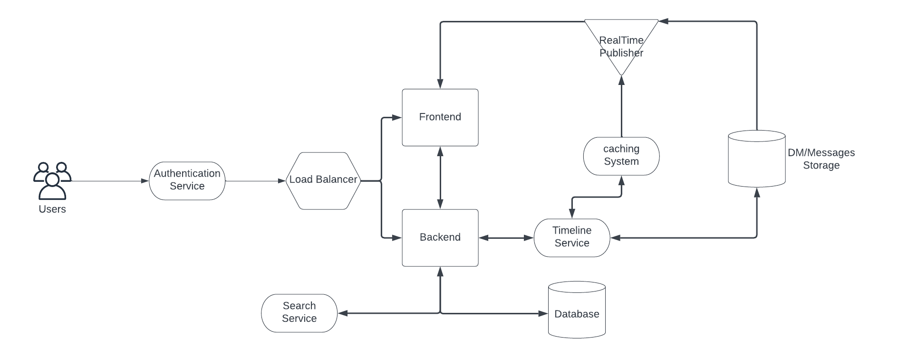
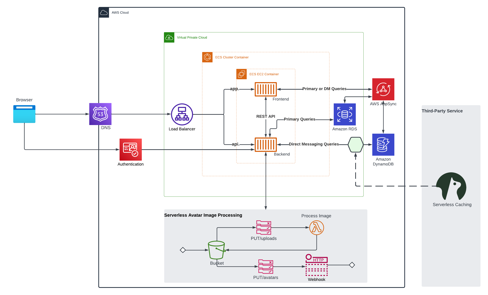

# Week 0 — Billing and Architecture

## Required Homework

### Recreate Cruddur Conceptual Diagram in Lucidchart

[Lucid Chart Share Link to The Conceptual Diagram](https://lucid.app/lucidchart/564b42a1-22c0-43a1-9836-da5901256136/edit?viewport_loc=-326%2C-4%2C1658%2C815%2C0_0&invitationId=inv_6b115f24-6145-447d-b74f-aadacfcae546)

### Recreate the Cruddur Logical Diagram in Lucidchart

[Lucidchart Share Link to the Logical Diagram](https://lucid.app/lucidchart/9c63bfbc-1ad6-4c75-86af-e252fc3b4e78/edit?viewport_loc=-1163%2C179%2C3552%2C1746%2C0_0&invitationId=inv_3c22fbce-954d-437e-a389-53906eeed9d4)

## Homework Challenges
