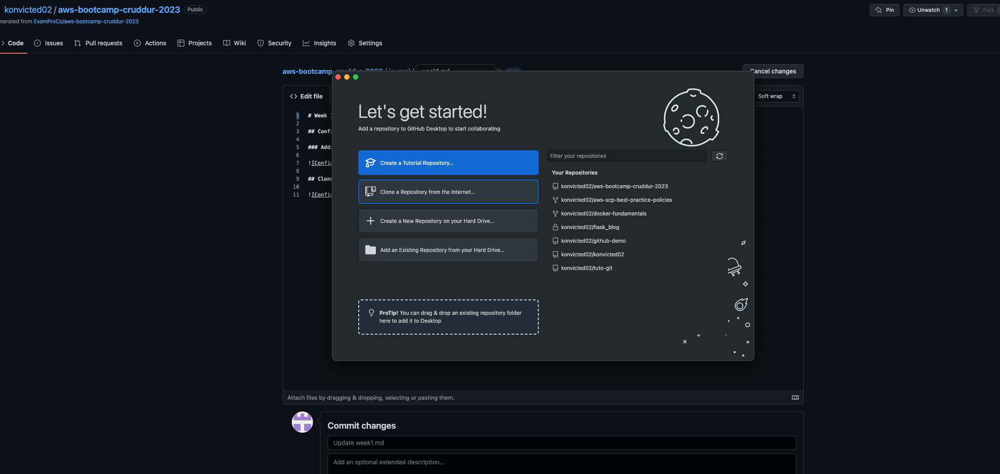
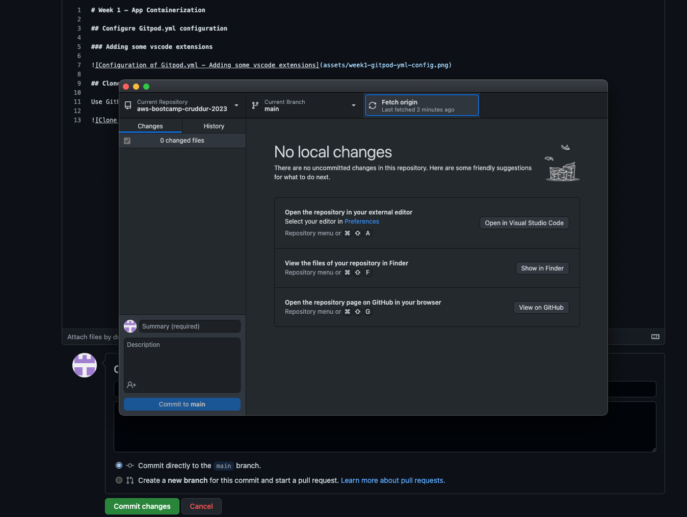
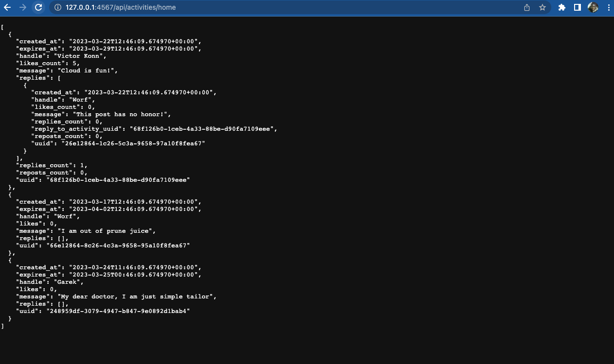
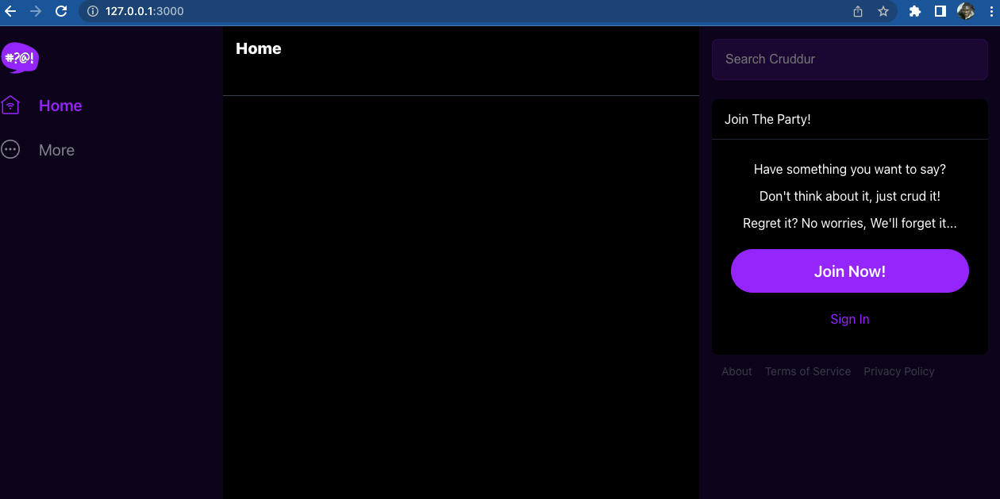
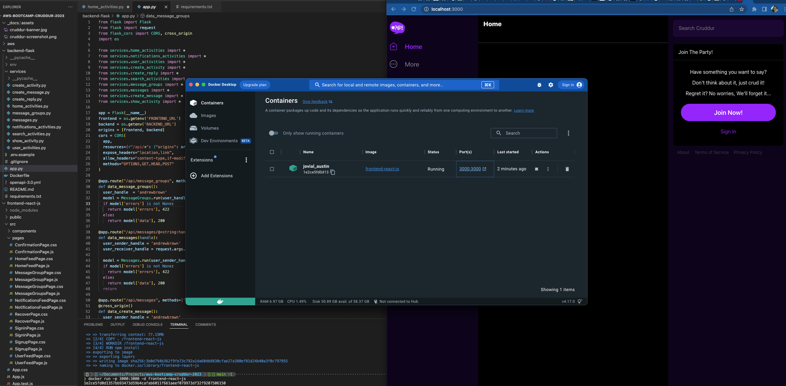
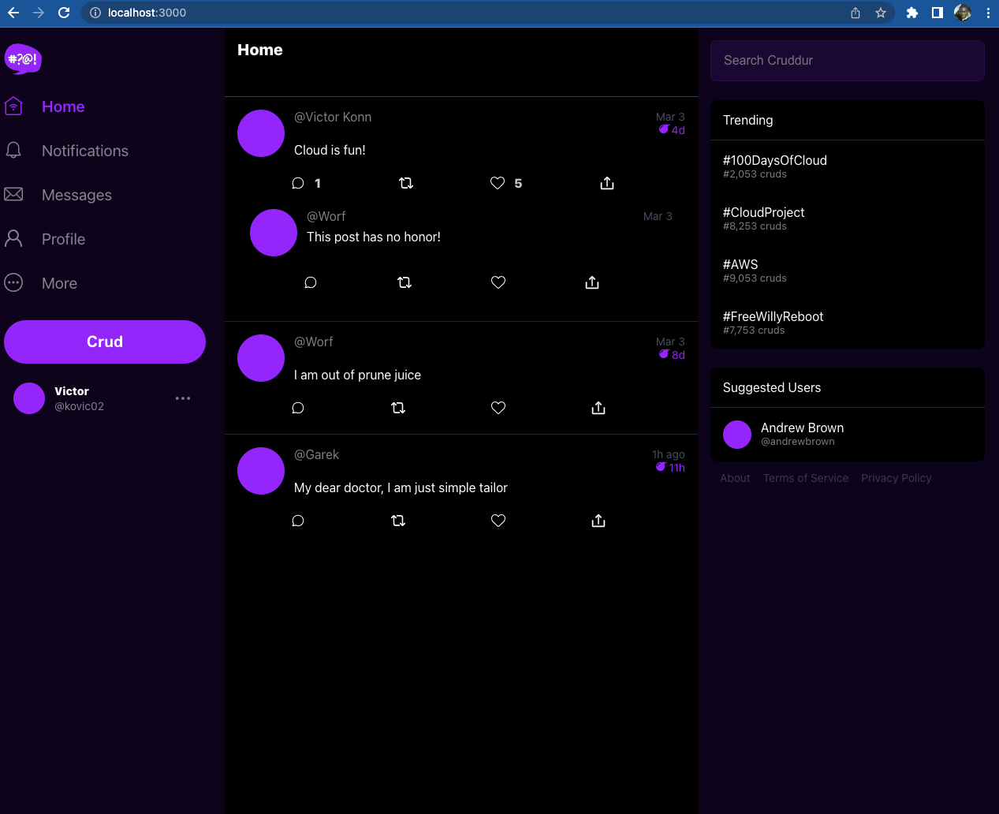
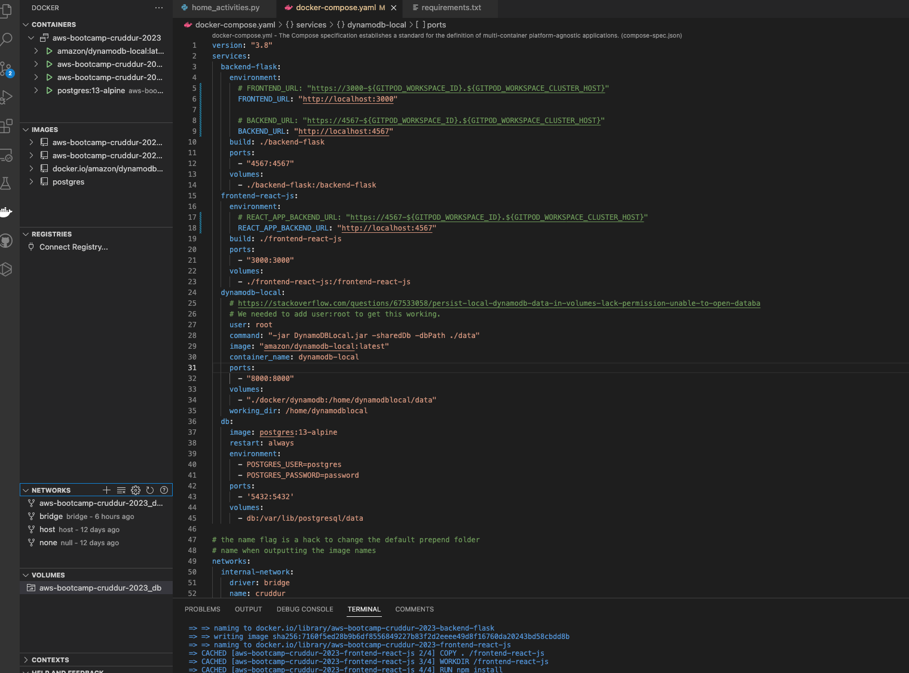

# Week 1 — App Containerization

## Configure Gitpod.yml configuration

### Adding some vscode extensions


## Clone our Cruddur App Repository Locally

Use GitHub Desktop to clone our remote repository ```konvicted02/aws-bootcamp-cruddur-2023```

**Screenshot 1**



**Screenshot 2**



## Run the application locally

### The Backend

**Run without container**

In the terminal, execute the following commands:

```sh
cd backend-flask
pip3 install -r requirements.txt
export FRONTEND_URL="*"
export BACKEND_URL="*"
python3 -m flask run --host=0.0.0.0 --port=4567
cd ..
```
Then:
- Open in the browser the link ```127.0.0.1:4567/api/activities/home```
- A JSON is diplayed as result in the browser

Note that the ```pip3 install -r requirements.txt``` to install the Flask and flask_cors modules can be run once in this case

**Run in container**

Below is the contain of our Dockerfile which must be located in the ```\backend-flask``` directory:

```dockerfile
FROM python:3.10-slim-buster

WORKDIR /backend-flask

COPY requirements.txt requirements.txt
RUN pip3 install -r requirements.txt

COPY . .

ENV FLASK_ENV=development

EXPOSE ${PORT}
CMD [ "python3", "-m" , "flask", "run", "--host=0.0.0.0", "--port=4567"]
```
- **Build the container image**

If in the ```backend-flask``` directory, run the commands:

```sh
cd ..
docker build -t  backend-flask ./backend-flask
```
- **Run the container in background in port 4567**

```sh
docker run --rm -p 4567:4567 -it -e FRONTEND_URL='*' -e BACKEND_URL='*' backend-flask
```

Open the link ```127.0.0.1:4567/api/activities/home``` or ```localhost:4567/api/activities/home``` in your browser. A JSON is displayed in the browser as result, just like in the screenshot below:



### The Frontend

**Run without container**

While in the our project directory, run the following commands:

```sh
cd frontend-react-js
npm i
npm start
```
Then open in your browser the link ```127.0.0.1:3000``` or ```localhost:3000```. A page like the one in the screenshot below will be displayed:



**Run in container**

Below is the contain of our Dockerfile which must be located in the ```frontend-react-js``` directory:

```dockerfile
FROM node:16.18

ENV PORT=3000

COPY . /frontend-react-js
WORKDIR /frontend-react-js
RUN npm install
EXPOSE ${PORT}
CMD ["npm", "start"]
```

- **Build the container image**

Run the command:

```sh
docker build -t frontend-react-js ./frontend-react-js
```
- **Run the container in background in port 3000**

```sh
docker run -p 3000:3000 -d frontend-react-js
```
Then open in your browser the link ```127.0.0.1:3000``` or ```localhost:3000```. A page with a dockerized frontend application will display. You can see the frontend running container displayed in the Docker Desktop in the screenshot below:



## Multiple Containers Application Orchastration - Locally

### Docker-compose file

At the root of the project, we created another ```docker-compose.yaml``` file with the content as follows:

```yaml
version: "3.8"
services:
  backend-flask:
    environment:
      # FRONTEND_URL: "https://3000-${GITPOD_WORKSPACE_ID}.${GITPOD_WORKSPACE_CLUSTER_HOST}"
      FRONTEND_URL: "http://localhost:3000"
      
      # BACKEND_URL: "https://4567-${GITPOD_WORKSPACE_ID}.${GITPOD_WORKSPACE_CLUSTER_HOST}"
      BACKEND_URL: "http://localhost:4567"
    build: ./backend-flask
    ports:
      - "4567:4567"
    volumes:
      - ./backend-flask:/backend-flask
  frontend-react-js:
    environment:
      # REACT_APP_BACKEND_URL: "https://4567-${GITPOD_WORKSPACE_ID}.${GITPOD_WORKSPACE_CLUSTER_HOST}"
      REACT_APP_BACKEND_URL: "http://localhost:4567"
    build: ./frontend-react-js
    ports:
      - "3000:3000"
    volumes:
      - ./frontend-react-js:/frontend-react-js
  dynamodb-local:
    # https://stackoverflow.com/questions/67533058/persist-local-dynamodb-data-in-volumes-lack-permission-unable-to-open-databa
    # We needed to add user:root to get this working.
    user: root
    command: "-jar DynamoDBLocal.jar -sharedDb -dbPath ./data"
    image: "amazon/dynamodb-local:latest"
    container_name: dynamodb-local
    ports:
      - "8000:8000"
    volumes:
      - "./docker/dynamodb:/home/dynamodblocal/data"
    working_dir: /home/dynamodblocal
  db:
    image: postgres:13-alpine
    restart: always
    environment:
      - POSTGRES_USER=postgres
      - POSTGRES_PASSWORD=password
    ports:
      - '5432:5432'
    volumes: 
      - db:/var/lib/postgresql/data

# the name flag is a hack to change the default prepend folder
# name when outputting the image names
networks: 
  internal-network:
    driver: bridge
    name: cruddur
volumes:
  db:
    driver: local
```

To create and start the containers (run the application), run the command:

```sh
docker-compose up
```
To run the application in the browser, open the link ```localhost:3000```



On the screenshot below, you can see 4 containers running in vscode containers section




