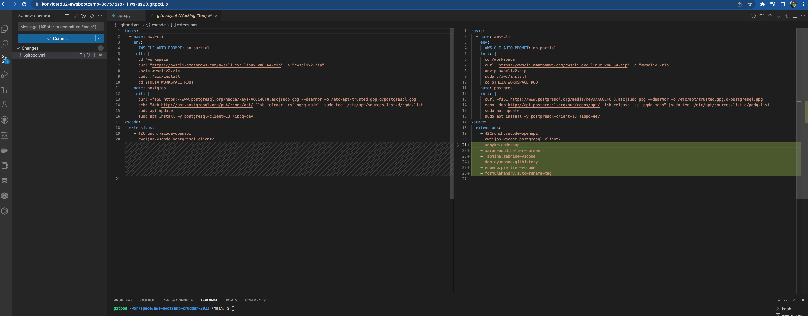

# Week 1 — App Containerization

## Configure Gitpod.yml configuration

### Adding some vscode extensions



## Clone our Cruddur App Repository Locally

Use GitHub Desktop to clone our remote repository ```konvicted02/aws-bootcamp-cruddur-2023```

**Screenshot 1**


**Screenshot 2**


